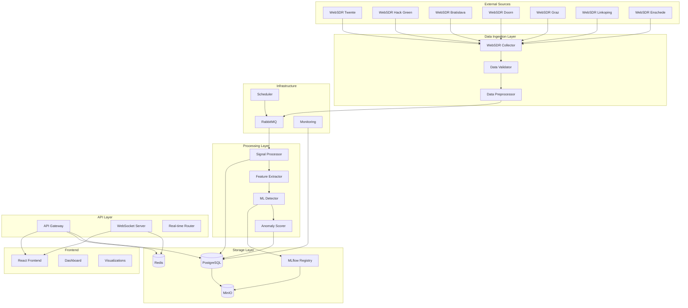

# Heimdall SDR - System Architecture

## Overview

Heimdall is a distributed Software-Defined Radio (SDR) monitoring and analysis platform designed to aggregate data from multiple WebSDR receivers across Europe, detect radio frequency anomalies using machine learning, and provide real-time visualization capabilities.

## Architectural Principles

### 1. Microservices Architecture
- **Service Isolation**: Each component runs independently with well-defined interfaces
- **Fault Tolerance**: Service failures don't cascade to other components
- **Scalability**: Individual services can be scaled based on demand
- **Technology Diversity**: Services can use different technologies optimized for their purpose

### 2. Event-Driven Design
- **Asynchronous Processing**: Non-blocking operations for real-time performance
- **Message Queuing**: Decoupled communication between services
- **Event Sourcing**: Complete audit trail of system events
- **Reactive Architecture**: Services respond to data changes and events

### 3. Data-Centric Architecture
- **Single Source of Truth**: PostgreSQL as primary data store
- **Layered Caching**: Redis for performance optimization
- **Data Lake**: MinIO for large-scale signal data storage
- **Stream Processing**: Real-time data transformation pipelines

## System Overview



## Core Services

### 1. WebSDR Collector Service

**Purpose**: Aggregate real-time data from multiple European WebSDR receivers

**Technology Stack**:
- Python 3.11+ with asyncio
- aiohttp for HTTP clients
- websockets for WebSocket connections
- pydantic for data validation

**Key Features**:
- Multi-station data collection
- Configurable sampling rates
- Automatic failover and retry logic
- Rate limiting and backpressure handling

**Architecture**:
```python
class WebSDRCollector:
    def __init__(self):
        self.stations = self._load_station_configs()
        self.data_queue = asyncio.Queue()
        self.rate_limiter = TokenBucket()
    
    async def collect_from_station(self, station_id: str):
        """Collect data from a specific WebSDR station."""
        station = self.stations[station_id]
        
        if station.api_type == "websocket":
            await self._collect_websocket(station)
        elif station.api_type == "http_streaming":
            await self._collect_http_stream(station)
        elif station.api_type == "http_polling":
            await self._collect_http_poll(station)
    
    async def _collect_websocket(self, station: WebSDRStation):
        """WebSocket-based data collection."""
        async with websockets.connect(station.ws_url) as websocket:
            while True:
                data = await websocket.recv()
                processed_data = self._parse_websdr_data(data, station)
                await self.data_queue.put(processed_data)
```

**Data Flow**:
1. Connect to WebSDR stations using appropriate protocols
2. Parse incoming signal data and metadata
3. Validate data format and completeness
4. Enqueue data for processing pipeline
5. Handle connection failures and automatic reconnection

### 2. Signal Processor Service

**Purpose**: Perform digital signal processing and feature extraction on collected data

**Technology Stack**:
- NumPy/SciPy for numerical computing
- PyFFTW for optimized FFT operations
- scikit-learn for feature engineering
- asyncio for concurrent processing

**Key Features**:
- Real-time FFT analysis
- Spectral feature extraction
- Signal characterization
- Noise reduction and filtering

**Architecture**:
```python
class SignalProcessor:
    def __init__(self, config: ProcessingConfig):
        self.fft_size = config.fft_size
        self.overlap = config.overlap
        self.window_function = config.window_function
        
    async def process_signal(self, signal_data: SignalData) -> ProcessedSignal:
        """Process raw signal data through DSP pipeline."""
        
        # Preprocessing
        cleaned_signal = self._preprocess(signal_data.samples)
        
        # Spectral analysis
        spectrum = self._compute_spectrum(cleaned_signal)
        
        # Feature extraction
        features = self._extract_features(spectrum, signal_data.metadata)
        
        # Quality assessment
        quality_score = self._assess_quality(features)
        
        return ProcessedSignal(
            frequency=signal_data.frequency,
            features=features,
            spectrum=spectrum,
            quality_score=quality_score,
            timestamp=signal_data.timestamp
        )
    
    def _extract_features(self, spectrum: np.ndarray, metadata: dict) -> SignalFeatures:
        """Extract comprehensive signal features."""
        return SignalFeatures(
            # Spectral features
            peak_frequency=self._find_peak_frequency(spectrum),
            bandwidth=self._calculate_bandwidth(spectrum),
            spectral_centroid=self._spectral_centroid(spectrum),
            spectral_rolloff=self._spectral_rolloff(spectrum),
            
            # Statistical features
            signal_power=np.mean(spectrum**2),
            snr_estimate=self._estimate_snr(spectrum),
            
            # Temporal features
            signal_duration=metadata.get('duration', 0),
            modulation_type=self._classify_modulation(spectrum)
        )
```

### 3. ML Detector Service

**Purpose**: Implement machine learning models for anomaly detection and signal classification

**Technology Stack**:
- scikit-learn for traditional ML algorithms
- TensorFlow/PyTorch for deep learning models
- MLflow for model management and versioning
- joblib for model serialization

**Key Features**:
- Multi-model ensemble approach
- Real-time anomaly scoring
- Adaptive learning capabilities
- Model performance monitoring

**Architecture**:
```python
class MLDetector:
    def __init__(self):
        self.models = self._load_models()
        self.feature_scaler = self._load_scaler()
        self.anomaly_threshold = 0.7
        
    async def detect_anomalies(self, features: SignalFeatures) -> AnomalyResult:
        """Detect anomalies using ensemble of ML models."""
        
        # Feature preprocessing
        scaled_features = self.feature_scaler.transform(features.to_array())
        
        # Model predictions
        predictions = {}
        for model_name, model in self.models.items():
            score = await self._predict_async(model, scaled_features)
            predictions[model_name] = score
        
        # Ensemble scoring
        anomaly_score = self._ensemble_score(predictions)
        
        # Classification
        is_anomaly = anomaly_score > self.anomaly_threshold
        
        return AnomalyResult(
            anomaly_score=anomaly_score,
            is_anomaly=is_anomaly,
            model_predictions=predictions,
            confidence=self._calculate_confidence(predictions),
            timestamp=datetime.utcnow()
        )
    
    def _ensemble_score(self, predictions: Dict[str, float]) -> float:
        """Combine predictions from multiple models."""
        weights = {
            'isolation_forest': 0.3,
            'lstm_autoencoder': 0.4,
            'variational_autoencoder': 0.3
        }
        
        weighted_score = sum(
            predictions[model] * weight 
            for model, weight in weights.items()
        )
        
        return weighted_score
```

### 4. API Gateway Service

**Purpose**: Provide RESTful API and WebSocket endpoints for frontend and external integrations

**Technology Stack**:
- FastAPI for async REST API
- WebSockets for real-time communication
- SQLAlchemy for database ORM
- Redis for caching and session management

**Key Features**:
- RESTful API design
- Real-time WebSocket streaming
- Authentication and authorization
- Request rate limiting
- API documentation with OpenAPI

**Architecture**:
```python
from fastapi import FastAPI, WebSocket, Depends
from fastapi.security import HTTPBearer

app = FastAPI(title="Heimdall SDR API", version="1.0.0")
security = HTTPBearer()

@app.get("/api/v1/signals/detections")
async def get_signal_detections(
    frequency_min: int = Query(...),
    frequency_max: int = Query(...),
    time_start: datetime = Query(...),
    time_end: datetime = Query(...),
    current_user: User = Depends(get_current_user)
) -> List[SignalDetection]:
    """Retrieve signal detections within specified parameters."""
    
    query = select(SignalDetection).where(
        and_(
            SignalDetection.frequency_hz >= frequency_min,
            SignalDetection.frequency_hz <= frequency_max,
            SignalDetection.detection_timestamp >= time_start,
            SignalDetection.detection_timestamp <= time_end
        )
    )
    
    results = await database.fetch_all(query)
    return [SignalDetection.from_orm(row) for row in results]

@app.websocket("/ws/signals/live")
async def websocket_live_signals(websocket: WebSocket):
    """Stream live signal detections to connected clients."""
    await websocket.accept()
    
    try:
        # Subscribe to Redis pub/sub for real-time updates
        subscriber = await redis.subscribe("signal_detections")
        
        while True:
            message = await subscriber.get_message()
            if message and message['type'] == 'message':
                detection = json.loads(message['data'])
                await websocket.send_json(detection)
                
    except WebSocketDisconnect:
        await subscriber.unsubscribe("signal_detections")
```

## Data Architecture

### Database Schema

**Primary Database**: PostgreSQL 15+

```sql
-- WebSDR Stations
CREATE TABLE websdr_stations (
    id UUID PRIMARY KEY DEFAULT gen_random_uuid(),
    name VARCHAR(255) NOT NULL,
    url VARCHAR(512) NOT NULL,
    location VARCHAR(255) NOT NULL,
    latitude DECIMAL(10, 8),
    longitude DECIMAL(11, 8),
    frequency_min BIGINT NOT NULL,
    frequency_max BIGINT NOT NULL,
    status station_status NOT NULL DEFAULT 'active',
    api_config JSONB,
    created_at TIMESTAMP WITH TIME ZONE DEFAULT NOW(),
    updated_at TIMESTAMP WITH TIME ZONE DEFAULT NOW()
);

-- Signal Detections
CREATE TABLE signal_detections (
    id UUID PRIMARY KEY DEFAULT gen_random_uuid(),
    websdr_station_id UUID NOT NULL REFERENCES websdr_stations(id),
    frequency_hz BIGINT NOT NULL,
    signal_strength_db FLOAT NOT NULL,
    bandwidth_hz INTEGER,
    modulation_type VARCHAR(50),
    signal_features JSONB,
    anomaly_score FLOAT,
    is_anomaly BOOLEAN DEFAULT FALSE,
    detection_timestamp TIMESTAMP WITH TIME ZONE NOT NULL,
    processing_metadata JSONB,
    created_at TIMESTAMP WITH TIME ZONE DEFAULT NOW(),
    updated_at TIMESTAMP WITH TIME ZONE DEFAULT NOW()
);

-- ML Models
CREATE TABLE ml_models (
    id UUID PRIMARY KEY DEFAULT gen_random_uuid(),
    name VARCHAR(255) NOT NULL,
    version VARCHAR(50) NOT NULL,
    model_type VARCHAR(100) NOT NULL,
    parameters JSONB,
    metrics JSONB,
    artifact_path VARCHAR(512),
    status model_status NOT NULL DEFAULT 'training',
    created_at TIMESTAMP WITH TIME ZONE DEFAULT NOW(),
    deployed_at TIMESTAMP WITH TIME ZONE
);

-- Anomaly Events
CREATE TABLE anomaly_events (
    id UUID PRIMARY KEY DEFAULT gen_random_uuid(),
    detection_id UUID NOT NULL REFERENCES signal_detections(id),
    event_type VARCHAR(100) NOT NULL,
    severity anomaly_severity NOT NULL,
    description TEXT,
    metadata JSONB,
    acknowledged BOOLEAN DEFAULT FALSE,
    acknowledged_by UUID,
    acknowledged_at TIMESTAMP WITH TIME ZONE,
    created_at TIMESTAMP WITH TIME ZONE DEFAULT NOW()
);
```

### Caching Strategy

**Redis Architecture**:

```python
# Cache keys structure
CACHE_KEYS = {
    # Real-time data (TTL: 60 seconds)
    "signals:live:{station_id}": "current signal data",
    "anomalies:recent": "last 100 anomaly detections",
    
    # Aggregated data (TTL: 300 seconds)
    "stats:hourly:{date}": "hourly statistics",
    "frequency:popular": "most monitored frequencies",
    
    # ML models (TTL: 3600 seconds)
    "models:active": "list of active models",
    "predictions:batch": "batch prediction results",
    
    # User sessions (TTL: 86400 seconds)
    "session:{user_id}": "user session data",
    "auth:token:{token_hash}": "authentication token"
}

class CacheManager:
    def __init__(self, redis_client):
        self.redis = redis_client
    
    async def cache_signal_data(self, station_id: str, data: SignalData):
        """Cache latest signal data for real-time access."""
        key = f"signals:live:{station_id}"
        await self.redis.setex(key, 60, data.json())
    
    async def get_recent_anomalies(self, limit: int = 100) -> List[AnomalyEvent]:
        """Retrieve recent anomaly events from cache."""
        cached = await self.redis.get("anomalies:recent")
        if cached:
            return [AnomalyEvent.parse_raw(item) for item in json.loads(cached)]
        
        # Cache miss - fetch from database
        anomalies = await self._fetch_recent_anomalies_from_db(limit)
        await self.redis.setex("anomalies:recent", 300, json.dumps([a.json() for a in anomalies]))
        return anomalies
```

### Object Storage

**MinIO Configuration**:

```python
# Bucket structure
MINIO_BUCKETS = {
    "signal-data": {
        "purpose": "Raw signal recordings",
        "retention": "30 days",
        "structure": "year/month/day/station_id/frequency_hz/"
    },
    "ml-artifacts": {
        "purpose": "ML model artifacts and datasets",
        "retention": "1 year",
        "structure": "models/name/version/"
    },
    "backups": {
        "purpose": "Database and configuration backups",
        "retention": "90 days",
        "structure": "database/date/"
    },
    "logs": {
        "purpose": "Application logs and metrics",
        "retention": "7 days",
        "structure": "service/date/hour/"
    }
}

class StorageManager:
    def __init__(self, minio_client):
        self.minio = minio_client
    
    async def store_signal_recording(self, 
                                   station_id: str, 
                                   frequency: int, 
                                   signal_data: bytes) -> str:
        """Store raw signal recording with organized path structure."""
        timestamp = datetime.utcnow()
        object_path = (f"signal-data/{timestamp.year}/"
                      f"{timestamp.month:02d}/"
                      f"{timestamp.day:02d}/"
                      f"{station_id}/"
                      f"{frequency}/"
                      f"{timestamp.isoformat()}.wav")
        
        await self.minio.put_object("signal-data", object_path, 
                                   io.BytesIO(signal_data), 
                                   len(signal_data))
        return object_path
```

## Message Queue Architecture

**RabbitMQ Configuration**:

```python
# Exchange and queue topology
EXCHANGES = {
    "heimdall.signals": {
        "type": "topic",
        "durable": True,
        "routing_keys": [
            "signal.collected.*",    # station_id
            "signal.processed.*",    # station_id
            "signal.anomaly.*",      # severity
        ]
    },
    "heimdall.ml": {
        "type": "direct",
        "durable": True,
        "routing_keys": [
            "ml.train",
            "ml.predict",
            "ml.evaluate"
        ]
    }
}

QUEUES = {
    "signal-processing": {
        "exchange": "heimdall.signals",
        "routing_key": "signal.collected.*",
        "consumer": "signal-processor",
        "prefetch_count": 10
    },
    "anomaly-detection": {
        "exchange": "heimdall.signals",
        "routing_key": "signal.processed.*",
        "consumer": "ml-detector",
        "prefetch_count": 5
    },
    "alerts": {
        "exchange": "heimdall.signals",
        "routing_key": "signal.anomaly.high",
        "consumer": "alert-manager",
        "prefetch_count": 1
    }
}

class MessageRouter:
    def __init__(self, connection):
        self.connection = connection
    
    async def publish_signal_data(self, station_id: str, signal_data: SignalData):
        """Publish collected signal data for processing."""
        routing_key = f"signal.collected.{station_id}"
        await self.connection.publish(
            exchange="heimdall.signals",
            routing_key=routing_key,
            body=signal_data.json(),
            properties={"delivery_mode": 2}  # Persistent
        )
    
    async def publish_anomaly(self, anomaly: AnomalyResult):
        """Publish detected anomaly with appropriate severity routing."""
        severity = "high" if anomaly.anomaly_score > 0.8 else "medium"
        routing_key = f"signal.anomaly.{severity}"
        
        await self.connection.publish(
            exchange="heimdall.signals",
            routing_key=routing_key,
            body=anomaly.json(),
            properties={"priority": 1 if severity == "high" else 0}
        )
```

## Frontend Architecture

**React/Next.js Structure**:

```typescript
// Component hierarchy
src/
├── components/
│   ├── common/           // Reusable UI components
│   ├── dashboard/        // Dashboard-specific components
│   ├── signals/          // Signal visualization components
│   └── anomalies/        // Anomaly detection components
├── pages/
│   ├── api/             // Next.js API routes
│   ├── dashboard/       // Dashboard pages
│   └── analysis/        // Analysis tools
├── hooks/
│   ├── useSignalData.ts // Real-time signal data
│   ├── useWebSocket.ts  // WebSocket connection
│   └── useAnomalies.ts  // Anomaly detection data
├── store/
│   ├── signalStore.ts   // Signal data state
│   ├── uiStore.ts       // UI state management
│   └── authStore.ts     // Authentication state
└── utils/
    ├── api.ts           // API client
    ├── websocket.ts     // WebSocket utilities
    └── chartUtils.ts    // Chart configuration

// Real-time data flow
interface SignalVisualizationProps {
  stationId: string;
  frequencyRange: [number, number];
}

export const SignalVisualization: React.FC<SignalVisualizationProps> = ({
  stationId,
  frequencyRange
}) => {
  // Real-time signal data
  const { data: signalData, isConnected } = useWebSocket({
    url: `/ws/signals/live`,
    filter: { stationId, frequencyRange }
  });
  
  // Chart configuration
  const chartConfig = useMemo(() => ({
    type: 'line',
    data: {
      datasets: [{
        label: 'Signal Strength',
        data: signalData?.map(d => ({
          x: d.frequency,
          y: d.signalStrength
        })) || []
      }]
    },
    options: {
      responsive: true,
      scales: {
        x: { type: 'linear', title: { text: 'Frequency (Hz)' }},
        y: { type: 'linear', title: { text: 'Signal Strength (dB)' }}
      },
      plugins: {
        tooltip: {
          callbacks: {
            label: (context) => `${context.parsed.y.toFixed(2)} dB`
          }
        }
      }
    }
  }), [signalData]);
  
  return (
    <div className="signal-visualization">
      <div className="status-indicator">
        <StatusLight isConnected={isConnected} />
        <span>Station: {stationId}</span>
      </div>
      <Chart config={chartConfig} />
      <FrequencyControls 
        range={frequencyRange}
        onChange={handleFrequencyChange}
      />
    </div>
  );
};
```

## Deployment Architecture

### Kubernetes Configuration

```yaml
# Deployment example for signal-processor service
apiVersion: apps/v1
kind: Deployment
metadata:
  name: heimdall-signal-processor
  labels:
    app: heimdall
    component: signal-processor
spec:
  replicas: 3
  selector:
    matchLabels:
      app: heimdall
      component: signal-processor
  template:
    metadata:
      labels:
        app: heimdall
        component: signal-processor
    spec:
      containers:
      - name: signal-processor
        image: ghcr.io/fulgidus/heimdall-signal-processor:latest
        ports:
        - containerPort: 8002
        env:
        - name: DATABASE_URL
          valueFrom:
            secretKeyRef:
              name: heimdall-secrets
              key: database-url
        - name: REDIS_URL
          valueFrom:
            configMapKeyRef:
              name: heimdall-config
              key: redis-url
        - name: RABBITMQ_URL
          valueFrom:
            secretKeyRef:
              name: heimdall-secrets
              key: rabbitmq-url
        resources:
          requests:
            memory: "512Mi"
            cpu: "250m"
          limits:
            memory: "1Gi"
            cpu: "500m"
        livenessProbe:
          httpGet:
            path: /health
            port: 8002
          initialDelaySeconds: 30
          periodSeconds: 10
        readinessProbe:
          httpGet:
            path: /ready
            port: 8002
          initialDelaySeconds: 5
          periodSeconds: 5
```

### Service Mesh Integration

```yaml
# Istio VirtualService for traffic management
apiVersion: networking.istio.io/v1beta1
kind: VirtualService
metadata:
  name: heimdall-api
spec:
  hosts:
  - api.heimdall.example.com
  http:
  - match:
    - uri:
        prefix: /api/v1/
    route:
    - destination:
        host: heimdall-api-gateway
        port:
          number: 8000
    fault:
      delay:
        percentage:
          value: 0.1
        fixedDelay: 5s
    retries:
      attempts: 3
      perTryTimeout: 2s
```

## Security Architecture

### Authentication & Authorization

Heimdall uses **Keycloak** as a centralized Identity and Access Management (IAM) solution.

#### Architecture

```
┌─────────────────┐
│   Frontend      │  ◄─── SSO (OIDC/PKCE)
│   (React)       │
└────────┬────────┘
         │ JWT Bearer Token
         ▼
┌─────────────────┐      ┌──────────────┐
│  API Gateway    │ ◄────┤  Keycloak    │
│                 │      │  (IAM)       │
└────────┬────────┘      └──────────────┘
         │ JWT Bearer Token      ▲
         ▼                       │
┌─────────────────┐             │
│  Microservices  │ ────────────┘
│  (RF, Training, │   Client Credentials
│   Inference)    │   (Service Auth)
└─────────────────┘
```

#### Authentication Implementation

```python
# services/common/auth/keycloak_auth.py
from fastapi import Depends, HTTPException
from fastapi.security import HTTPBearer
import jwt
from jwt import PyJWKClient

class KeycloakAuth:
    """Keycloak authentication handler."""
    
    def __init__(self, keycloak_url: str, realm: str):
        self.keycloak_url = keycloak_url
        self.realm = realm
        self.jwks_url = f"{keycloak_url}/realms/{realm}/protocol/openid-connect/certs"
        self.jwk_client = PyJWKClient(self.jwks_url)
    
    def verify_token(self, token: str) -> dict:
        """Verify JWT token and extract claims."""
        signing_key = self.jwk_client.get_signing_key_from_jwt(token)
        payload = jwt.decode(
            token,
            signing_key.key,
            algorithms=["RS256"],
            audience=["account"],
        )
        return payload

# Usage in FastAPI endpoints
from auth import get_current_user, require_operator, User

@app.post("/acquisition/trigger")
async def trigger_acquisition(user: User = Depends(require_operator)):
    """Only operators and admins can trigger acquisitions."""
    return {"status": "triggered", "by": user.username}
```

#### Role-Based Access Control (RBAC)

```python
# Heimdall roles and permissions
ROLES = {
    "admin": {
        "description": "Administrator with full system access",
        "permissions": [
            "signals:read", "signals:write", "signals:delete",
            "models:read", "models:write", "models:deploy",
            "system:read", "system:write", "users:manage"
        ]
    },
    "operator": {
        "description": "Operator with read/write access",
        "permissions": [
            "signals:read", "signals:write",
            "models:read", "models:write",
            "system:read"
        ]
    },
    "viewer": {
        "description": "Viewer with read-only access",
        "permissions": [
            "signals:read",
            "models:read",
            "system:read"
        ]
    }
}

# FastAPI dependencies for role checking
@app.get("/admin-only")
async def admin_endpoint(user: User = Depends(require_admin)):
    return {"access": "granted"}

@app.post("/operator-action")
async def operator_endpoint(user: User = Depends(require_operator)):
    return {"action": "performed"}

@app.get("/public-data")
async def viewer_endpoint(user: User = Depends(get_current_user)):
    # Any authenticated user can access
    return {"data": "..."}
```

#### Service-to-Service Authentication

```python
# Service client for inter-service communication
class ServiceAuthClient:
    """Client for service-to-service authentication."""
    
    def __init__(self, client_id: str, client_secret: str):
        self.client_id = client_id
        self.client_secret = client_secret
        self.token = None
        self.token_expiry = None
    
    def get_token(self) -> str:
        """Get access token using client credentials flow."""
        if self.token and datetime.now() < self.token_expiry:
            return self.token
        
        # Fetch new token from Keycloak
        token_url = f"{KEYCLOAK_URL}/realms/{REALM}/protocol/openid-connect/token"
        response = requests.post(token_url, data={
            "grant_type": "client_credentials",
            "client_id": self.client_id,
            "client_secret": self.client_secret,
        })
        
        result = response.json()
        self.token = result["access_token"]
        self.token_expiry = datetime.now() + timedelta(seconds=result["expires_in"] - 300)
        
        return self.token
    
    def call_service(self, url: str, method: str = "GET", **kwargs):
        """Make authenticated request to another service."""
        token = self.get_token()
        headers = kwargs.get("headers", {})
        headers["Authorization"] = f"Bearer {token}"
        kwargs["headers"] = headers
        
        return requests.request(method, url, **kwargs)
```

### Data Encryption

```python
# Encryption for sensitive data
class EncryptionService:
    def __init__(self, key: bytes):
        self.cipher_suite = Fernet(key)
    
    def encrypt_config(self, config_data: dict) -> str:
        """Encrypt configuration data."""
        json_data = json.dumps(config_data)
        encrypted_data = self.cipher_suite.encrypt(json_data.encode())
        return base64.b64encode(encrypted_data).decode()
    
    def decrypt_config(self, encrypted_data: str) -> dict:
        """Decrypt configuration data."""
        encrypted_bytes = base64.b64decode(encrypted_data.encode())
        decrypted_data = self.cipher_suite.decrypt(encrypted_bytes)
        return json.loads(decrypted_data.decode())
```

## RBAC Architecture

Heimdall implements **Role-Based Access Control (RBAC)** with the introduction of **Constellations** - logical groupings of WebSDR stations that can be owned, shared, and managed by users with different permission levels.

### Core Concepts

#### Constellations

A **Constellation** is a logical grouping of WebSDR stations used for localization sessions. Constellations enable:

- **Organization**: Group geographically-related or functionally-related SDR stations
- **Access Control**: Control who can use which stations for localization
- **Collaboration**: Share constellations with other users (read or edit permissions)
- **Isolation**: Separate resources for different teams or projects

**Example Use Cases**:
- "Northern Italy Coverage" - Stations covering northern Italy
- "VHF Monitoring Network" - Stations optimized for VHF frequencies
- "Team Alpha Resources" - Stations assigned to a specific team

#### Ownership Model

Heimdall implements ownership for three types of resources:

1. **Constellations**: Groups of WebSDR stations
2. **Sources**: Known RF sources (transmitters/beacons)
3. **Models**: Trained ML models for localization

Each resource has:
- **Owner**: The user who created the resource (Keycloak user ID)
- **Sharing**: Optional sharing with other users (read/edit permissions)
- **Admin Bypass**: Admins can access all resources regardless of ownership

#### Permission Levels

Resources can be shared with two permission levels:

- **Read**: View the resource and its details, use it in sessions (for Constellations)
- **Edit**: View + modify the resource (name, description, members)

**Owner Privileges** (beyond edit permission):
- Delete the resource
- Share the resource with other users
- Modify sharing permissions

**Note**: WebSDR stations themselves remain **globally visible** to all authenticated users. Only their assignment to Constellations is controlled by RBAC.

### Role Hierarchy

Heimdall uses three roles from Keycloak with hierarchical permissions:

```
ADMIN
  ├── Full system access
  ├── Can view/edit ALL resources (bypasses ownership)
  ├── Can manage users and assignments
  └── Can modify system settings

OPERATOR
  ├── Can create Constellations, Sources, Models
  ├── Can view/edit owned or shared resources
  ├── Can share owned resources
  ├── Can start RF acquisitions and training sessions
  └── Can generate synthetic samples

USER
  ├── Can view assigned Constellations
  ├── Can start localization sessions on assigned Constellations
  ├── Can set frequency and parameters
  └── Can view history of assigned Constellations
```

**Role Detection**:
```python
# Backend (Keycloak JWT claims)
def extract_roles_from_token(token: dict) -> List[str]:
    """Extract roles from Keycloak token."""
    # Realm roles
    realm_roles = token.get("realm_access", {}).get("roles", [])
    
    # Client roles (if using client-specific roles)
    client_roles = token.get("resource_access", {}).get("heimdall", {}).get("roles", [])
    
    return realm_roles + client_roles

# Role hierarchy check
def is_admin(user: User) -> bool:
    return "admin" in user.roles

def is_operator(user: User) -> bool:
    return "operator" in user.roles or is_admin(user)

def is_user(user: User) -> bool:
    return "user" in user.roles or is_operator(user)
```

### Database Schema

#### New Tables

**constellations**
```sql
CREATE TABLE constellations (
    id UUID PRIMARY KEY DEFAULT uuid_generate_v4(),
    name VARCHAR(255) NOT NULL,
    description TEXT,
    owner_id VARCHAR(255) NOT NULL,  -- Keycloak user ID
    created_at TIMESTAMPTZ DEFAULT NOW(),
    updated_at TIMESTAMPTZ DEFAULT NOW()
);

CREATE INDEX idx_constellations_owner ON constellations(owner_id);
```

**constellation_members** (Many-to-Many: Constellations ↔ WebSDRs)
```sql
CREATE TABLE constellation_members (
    id UUID PRIMARY KEY DEFAULT uuid_generate_v4(),
    constellation_id UUID NOT NULL REFERENCES constellations(id) ON DELETE CASCADE,
    websdr_station_id UUID NOT NULL REFERENCES websdr_stations(id) ON DELETE CASCADE,
    added_at TIMESTAMPTZ DEFAULT NOW(),
    added_by VARCHAR(255),
    UNIQUE(constellation_id, websdr_station_id)
);

CREATE INDEX idx_constellation_members_constellation ON constellation_members(constellation_id);
CREATE INDEX idx_constellation_members_websdr ON constellation_members(websdr_station_id);
```

**constellation_shares** (Constellation Access Control)
```sql
CREATE TABLE constellation_shares (
    id UUID PRIMARY KEY DEFAULT uuid_generate_v4(),
    constellation_id UUID NOT NULL REFERENCES constellations(id) ON DELETE CASCADE,
    user_id VARCHAR(255) NOT NULL,  -- Keycloak user ID
    permission VARCHAR(20) NOT NULL CHECK (permission IN ('read', 'edit')),
    shared_by VARCHAR(255) NOT NULL,
    shared_at TIMESTAMPTZ DEFAULT NOW(),
    UNIQUE(constellation_id, user_id)
);

CREATE INDEX idx_constellation_shares_constellation ON constellation_shares(constellation_id);
CREATE INDEX idx_constellation_shares_user ON constellation_shares(user_id);
```

**source_shares** and **model_shares** follow the same pattern for Sources and Models.

#### Modified Tables

**known_sources** - Added ownership:
```sql
ALTER TABLE known_sources 
    ADD COLUMN owner_id VARCHAR(255),
    ADD COLUMN is_public BOOLEAN DEFAULT false;
```

**models** - Added ownership:
```sql
ALTER TABLE models 
    ADD COLUMN owner_id VARCHAR(255),
    ADD COLUMN description TEXT;
```

**recording_sessions** - Linked to Constellations:
```sql
ALTER TABLE recording_sessions 
    ADD COLUMN constellation_id UUID REFERENCES constellations(id);
```

### RBAC Enforcement

#### Backend Utilities

Centralized RBAC logic in `services/common/auth/rbac.py`:

```python
async def can_view_constellation(
    db: asyncpg.Connection,
    user_id: str,
    constellation_id: uuid.UUID,
    is_admin: bool
) -> bool:
    """Check if user can view a constellation."""
    if is_admin:
        return True
    
    # Check ownership
    query = "SELECT owner_id FROM constellations WHERE id = $1"
    owner_id = await db.fetchval(query, constellation_id)
    
    if owner_id == user_id:
        return True
    
    # Check sharing
    share_query = """
        SELECT permission FROM constellation_shares 
        WHERE constellation_id = $1 AND user_id = $2
    """
    permission = await db.fetchval(share_query, constellation_id, user_id)
    
    return permission in ('read', 'edit')


async def can_edit_constellation(
    db: asyncpg.Connection,
    user_id: str,
    constellation_id: uuid.UUID,
    is_admin: bool
) -> bool:
    """Check if user can edit a constellation."""
    if is_admin:
        return True
    
    # Check ownership
    owner_id = await db.fetchval(
        "SELECT owner_id FROM constellations WHERE id = $1",
        constellation_id
    )
    
    if owner_id == user_id:
        return True
    
    # Check for 'edit' permission
    permission = await db.fetchval(
        "SELECT permission FROM constellation_shares WHERE constellation_id = $1 AND user_id = $2",
        constellation_id, user_id
    )
    
    return permission == 'edit'
```

**Similar functions exist for**:
- `can_delete_constellation()` - Owner or admin only
- `can_view_source()`, `can_edit_source()` - Source permissions
- `can_view_model()`, `can_edit_model()` - Model permissions
- `get_user_constellations()` - Retrieve accessible constellations

#### API Endpoint Protection

```python
from common.auth import get_current_user, require_operator
from common.auth.rbac import can_edit_constellation

@router.put("/constellations/{constellation_id}")
async def update_constellation(
    constellation_id: uuid.UUID,
    update_data: ConstellationUpdate,
    user: User = Depends(get_current_user),
    db: asyncpg.Connection = Depends(get_pool)
):
    """Update constellation (requires edit permission)."""
    
    # Check permission
    can_edit = await can_edit_constellation(
        db, user.user_id, constellation_id, user.is_admin
    )
    
    if not can_edit:
        raise HTTPException(status_code=403, detail="Insufficient permissions")
    
    # Perform update
    query = """
        UPDATE constellations 
        SET name = $1, description = $2, updated_at = NOW()
        WHERE id = $3
        RETURNING *
    """
    
    result = await db.fetchrow(
        query, update_data.name, update_data.description, constellation_id
    )
    
    return ConstellationResponse.from_db(result)
```

**Access Control Patterns**:

1. **Role-Based Route Access**: Some routes require specific roles
   - `require_operator` dependency → Operators and Admins only
   - `require_admin` dependency → Admins only
   - `get_current_user` dependency → Any authenticated user

2. **Resource-Based Access**: Endpoints check ownership/sharing
   - View operations: Owner, shared users, or admin
   - Edit operations: Owner, users with 'edit' permission, or admin
   - Delete operations: Owner or admin only
   - Share operations: Owner or admin only

3. **Admin Bypass**: Admins can access all resources
   - All RBAC functions check `is_admin` first
   - Admins bypass ownership and sharing checks

### Frontend Guards

#### Route Guards

**App.tsx** uses `RequireRole` component to protect routes:

```typescript
// User+ routes (USER, OPERATOR, ADMIN)
<Route path="/dashboard" element={
  <RequireRole role="user">
    <Dashboard />
  </RequireRole>
} />

// Operator+ routes (OPERATOR, ADMIN)
<Route path="/constellations" element={
  <RequireRole role="operator">
    <Constellations />
  </RequireRole>
} />

// Admin-only routes
<Route path="/settings" element={
  <RequireRole role="admin">
    <Settings />
  </RequireRole>
} />
```

#### Component-Level Guards

**usePermissions Hook** for conditional UI rendering:

```typescript
import { usePermissions } from '@/hooks/usePermissions';

function ConstellationCard({ constellation }: Props) {
  const { canEdit, canDelete, canShare } = usePermissions();
  
  const canEditThis = canEdit(constellation.ownerId, constellation.permission);
  const canDeleteThis = canDelete(constellation.ownerId);
  const canShareThis = canShare(constellation.ownerId);
  
  return (
    <Card>
      <h3>{constellation.name}</h3>
      
      {canEditThis && (
        <Button onClick={handleEdit}>Edit</Button>
      )}
      
      {canDeleteThis && (
        <Button onClick={handleDelete} variant="danger">Delete</Button>
      )}
      
      {canShareThis && (
        <Button onClick={handleShare}>Share</Button>
      )}
    </Card>
  );
}
```

### Permission Matrix

| Resource | USER | OPERATOR | ADMIN |
|----------|------|----------|-------|
| **Constellations** | View assigned (read) | CRUD owned/shared (edit) | Full access |
| **Sources** | View public/shared | CRUD owned/shared | Full access |
| **Models** | View shared | CRUD owned/shared | Full access |
| **Sessions** | Start on assigned constellations | Full control on accessible | Full control |
| **WebSDRs** | View all (global) | View all + assign to constellations | Full access |
| **System Settings** | ❌ | ❌ | ✅ |

### Data Migration

Existing deployments require data migration:

```sql
-- Migration: 05-migrate-existing-data.sql

-- 1. Set default owner for existing sources/models
UPDATE known_sources SET owner_id = 'admin-user-id' WHERE owner_id IS NULL;
UPDATE models SET owner_id = 'admin-user-id' WHERE owner_id IS NULL;

-- 2. Create default "Global" constellation
INSERT INTO constellations (id, name, description, owner_id)
VALUES (
    '00000000-0000-0000-0000-000000000001',
    'Global Constellation',
    'Default constellation containing all WebSDR stations',
    'admin-user-id'
);

-- 3. Add all existing WebSDRs to Global constellation
INSERT INTO constellation_members (constellation_id, websdr_station_id, added_by)
SELECT 
    '00000000-0000-0000-0000-000000000001',
    id,
    'admin-user-id'
FROM websdr_stations;
```

### Security Considerations

1. **JWT Validation**: All API requests validate JWT tokens from Keycloak
2. **User ID Trust**: User IDs from JWT `sub` claim are trusted after validation
3. **SQL Injection Prevention**: All queries use parameterized statements
4. **Permission Leakage**: API responses filter data based on user permissions
5. **Audit Trail**: `shared_by`, `added_by` fields track who performed actions

### Testing Strategy

**Unit Tests** (`services/common/auth/tests/test_rbac.py`):
- 67 test cases covering all RBAC utility functions
- Test ownership checks, sharing checks, admin bypass
- Test permission inheritance (admin > operator > user)

**Integration Tests** (`services/backend/tests/integration/test_constellations_rbac.py`):
- 50+ test cases covering API endpoints with permissions
- Test CRUD operations with different roles
- Test sharing workflows (create/update/delete shares)
- Test 403 Forbidden responses for unauthorized access
- Test 404 responses for non-existent resources

### Performance Considerations

1. **Database Indexes**: All foreign keys and lookup columns indexed
2. **Permission Caching**: Consider caching permission checks in Redis (future)
3. **Query Optimization**: RBAC queries use indexed columns (`owner_id`, `user_id`)
4. **Eager Loading**: Frontend fetches permissions with resource data

### Future Enhancements

- **Resource Groups**: Group multiple resources for bulk sharing
- **Time-Limited Sharing**: Share resources with expiration dates
- **Fine-Grained Permissions**: Additional permission levels (e.g., 'execute', 'export')
- **Audit Logs**: Comprehensive audit trail for all RBAC actions
- **LDAP/AD Integration**: Support for enterprise directory services

## Monitoring & Observability

### Metrics Collection

```python
# Prometheus metrics
from prometheus_client import Counter, Histogram, Gauge

# Service metrics
SIGNAL_PROCESSING_DURATION = Histogram(
    'signal_processing_seconds',
    'Time spent processing signals',
    ['station_id', 'frequency_band']
)

ANOMALIES_DETECTED = Counter(
    'anomalies_detected_total',
    'Total number of anomalies detected',
    ['severity', 'station_id']
)

WEBSDR_CONNECTION_STATUS = Gauge(
    'websdr_connection_status',
    'WebSDR station connection status',
    ['station_id']
)

# Usage in service
@SIGNAL_PROCESSING_DURATION.labels(station_id='twente-nl', frequency_band='hf').time()
async def process_signal(signal_data: SignalData) -> ProcessedSignal:
    # Processing logic
    result = await signal_processor.process(signal_data)
    
    if result.anomaly_score > 0.7:
        ANOMALIES_DETECTED.labels(
            severity='high',
            station_id=signal_data.station_id
        ).inc()
    
    return result
```

### Distributed Tracing

```python
# OpenTelemetry integration
from opentelemetry import trace
from opentelemetry.exporter.jaeger.thrift import JaegerExporter
from opentelemetry.sdk.trace import TracerProvider
from opentelemetry.sdk.trace.export import BatchSpanProcessor

# Tracer setup
tracer = trace.get_tracer(__name__)

async def collect_websdr_data(station_id: str):
    """Collect data with distributed tracing."""
    with tracer.start_as_current_span("websdr-collection") as span:
        span.set_attribute("station.id", station_id)
        
        try:
            # Data collection logic
            data = await websdr_client.collect(station_id)
            span.set_attribute("data.size", len(data))
            
            # Process data
            with tracer.start_as_current_span("signal-processing") as child_span:
                result = await signal_processor.process(data)
                child_span.set_attribute("processing.duration", result.duration)
            
            return result
            
        except Exception as e:
            span.record_exception(e)
            span.set_status(trace.Status(trace.StatusCode.ERROR, str(e)))
            raise
```

---

This architecture provides a solid foundation for the Heimdall SDR platform, emphasizing scalability, reliability, and maintainability while supporting real-time signal processing and machine learning capabilities.
