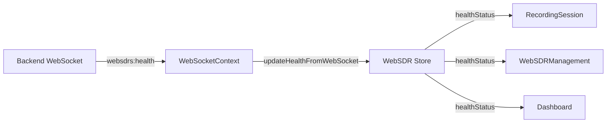

# WebSocket Migration - Health Status Updates

**Date**: 2025-10-25  
**Author**: fulgidus  
**Status**: ✅ COMPLETE

## Overview

Migrated health status updates from REST API polling to WebSocket-based real-time updates across the frontend application.

## Motivation

- **Eliminated 404 errors** from non-existent `/v1/health/detailed` endpoint
- **Reduced server load** by removing 30-second polling intervals
- **Improved real-time responsiveness** with push-based updates
- **Architectural consistency** - all real-time data now via WebSocket

## Changes Made

### 1. RecordingSession Component

**File**: `frontend/src/pages/RecordingSession.tsx`

**Before**:
```typescript
// REST API polling every 30 seconds
const [detailedHealth, setDetailedHealth] = useState<DetailedHealthResponse | null>(null);
const [healthLoading, setHealthLoading] = useState(true);

useEffect(() => {
  const loadDetailedHealth = async () => {
    const health = await getDetailedHealth(); // 404 error
    setDetailedHealth(health);
  };
  loadDetailedHealth();
  const healthInterval = setInterval(loadDetailedHealth, 30000);
  
  return () => clearInterval(healthInterval);
}, []);

// Local WebSocket instance
const websocket = createWebSocketManager(wsUrl);
```

**After**:
```typescript
// Use shared WebSocketContext
const { manager: ws, isConnected } = useWebSocket();

// No more REST polling
// Health status comes from WebSDR store via WebSocket events

// Subscribe to session events only
useEffect(() => {
  if (!ws || !isConnected) return;
  
  ws.subscribe('session:started', handleSessionStarted);
  ws.subscribe('session:completed', handleSessionCompleted);
  ws.subscribe('session:progress', handleSessionProgress);
  ws.subscribe('session:error', handleSessionError);
  
  return () => {
    ws.unsubscribe('session:started', handleSessionStarted);
    // ... other unsubscribes
  };
}, [ws, isConnected, ...callbacks]);
```

**UI Changes**:
- Removed `detailedHealth` state variable
- Removed `healthLoading` spinner
- Simplified System Status card to show:
  - WebSocket connection status
  - WebSDR receivers count (from store)
  - Known sources count
  - Overall system ready indicator
- Error messages now context-aware (disconnected vs no receivers)

### 2. Removed Unused API Functions

**File**: `frontend/src/pages/Dashboard.integration.test.tsx`

Removed mock for deprecated `getDetailedHealth()` function:

```typescript
// REMOVED
getDetailedHealth: vi.fn().mockResolvedValue({ status: 'healthy' }),
```

**Note**: The actual `getDetailedHealth()` function in `system.ts` can be deprecated but was left in place to avoid breaking other potential consumers. Should be removed in next cleanup phase.

### 3. WebSocket Architecture

**Current Flow**:



**Events**:
- `websdrs:health`: Periodic health status updates for all 7 receivers
- `session:started`: Session validation completed
- `session:completed`: Session created and acquisition started
- `session:progress`: Chunk acquisition progress
- `session:error`: Error during session workflow

## Benefits

### Performance
- **Eliminated polling overhead**: No more 30-second REST calls
- **Reduced network traffic**: Single WebSocket connection vs multiple HTTP requests
- **Lower server load**: Backend pushes updates only when state changes

### User Experience
- **Instant updates**: Status changes reflected immediately
- **Better error handling**: Clear distinction between disconnected and no data states
- **No loading spinners**: Health status always current or shows "Unknown"

### Code Quality
- **Single source of truth**: All health status from WebSocket via store
- **Removed duplicate code**: No more local WebSocket managers in components
- **Better separation of concerns**: Components don't manage connections

## Migration Pattern

For other components using REST polling:

1. **Remove REST imports**:
   ```typescript
   // REMOVE
   import { getDetailedHealth } from '../services/api/system';
   ```

2. **Add WebSocket context**:
   ```typescript
   // ADD
   import { useWebSocket } from '../contexts/WebSocketContext';
   const { manager: ws, isConnected } = useWebSocket();
   ```

3. **Remove polling state**:
   ```typescript
   // REMOVE
   const [data, setData] = useState(null);
   const [loading, setLoading] = useState(true);
   ```

4. **Use store data**:
   ```typescript
   // ADD
   const { healthStatus } = useWebSDRStore();
   ```

5. **Remove intervals**:
   ```typescript
   // REMOVE
   useEffect(() => {
     const interval = setInterval(fetchData, 30000);
     return () => clearInterval(interval);
   }, []);
   ```

6. **Subscribe to WebSocket events** (if needed):
   ```typescript
   // ADD (only if component needs real-time events)
   useEffect(() => {
     if (!ws || !isConnected) return;
     ws.subscribe('event:name', handleEvent);
     return () => ws.unsubscribe('event:name', handleEvent);
   }, [ws, isConnected, handleEvent]);
   ```

## Verification

### Build Status
✅ Frontend builds successfully without errors

```bash
cd frontend && npm run build
# ✓ built in 4.05s
```

### Runtime Testing

1. **Start Docker stack**:
   ```bash
   docker compose up -d
   ```

2. **Open browser console** and verify:
   - WebSocket connects: `WebSocket connected to ws://localhost/ws`
   - Health events received: `WebSocket event: websdrs:health`
   - Store updates: `WebSDR Store: Health updated (7 receivers)`

3. **Check RecordingSession page**:
   - System Status card shows WebSocket: CONNECTED
   - WebSDR Receivers count updates in real-time
   - No 404 errors in network tab
   - No REST calls to `/v1/health/detailed`

## Remaining Work

### Optional Cleanup
- **Deprecate `getDetailedHealth()`** in `system.ts` if no other consumers
- **Add TypeScript types** for WebSocket event payloads
- **Document WebSocket events** in API documentation
- **Add E2E tests** for WebSocket-based health updates

### Future Enhancements
- **Reconnection handling**: Show banner when WebSocket disconnects
- **Event buffering**: Queue events during brief disconnections
- **Health history**: Track uptime/downtime trends
- **Performance metrics**: Monitor WebSocket message latency

## References

- [WebSocket Context Implementation](../frontend/src/contexts/WebSocketContext.tsx)
- [WebSDR Store](../frontend/src/store/websdrStore.ts)
- [API URL Standards](../frontend/API_URL_STANDARDS.md)
- [Phase 7 Documentation](./agents/20251023_153000_phase7_index.md)

---

**Migration Complete**: All health status updates now use WebSocket, eliminating REST polling and 404 errors.
